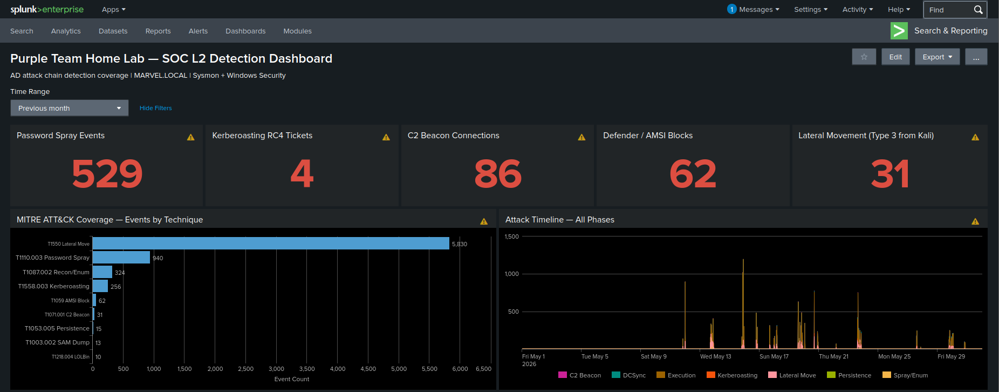
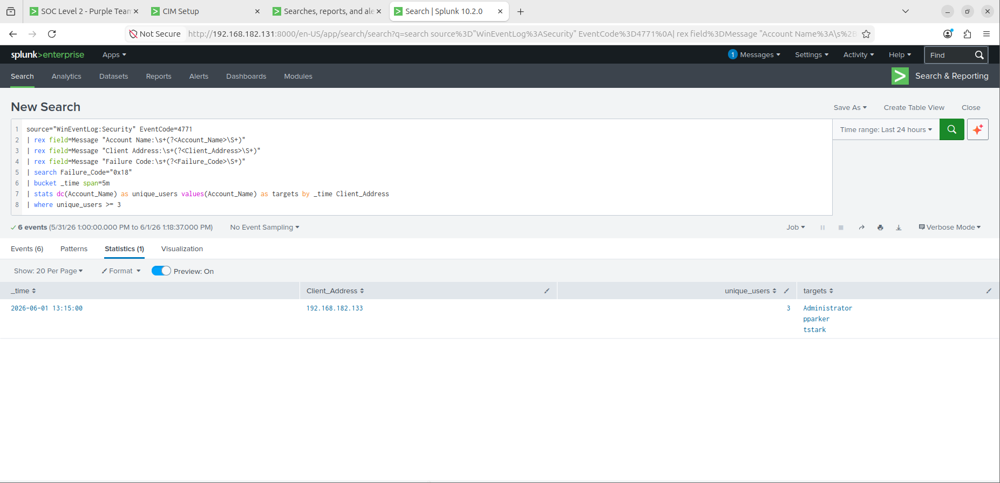
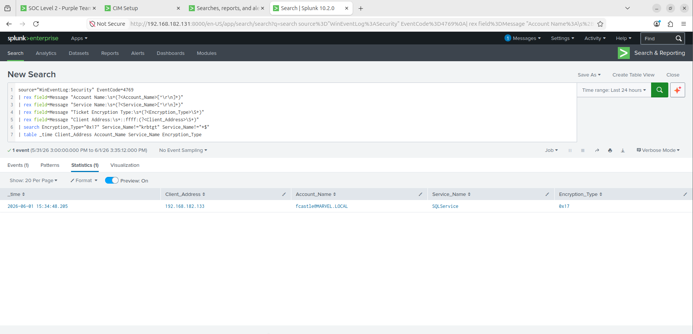
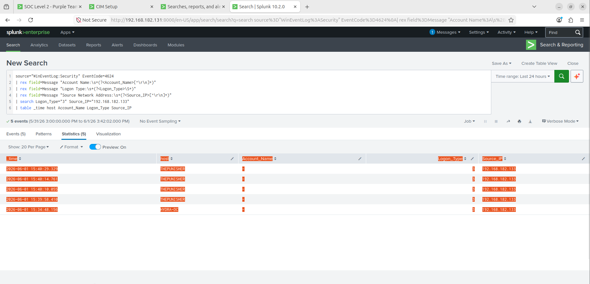
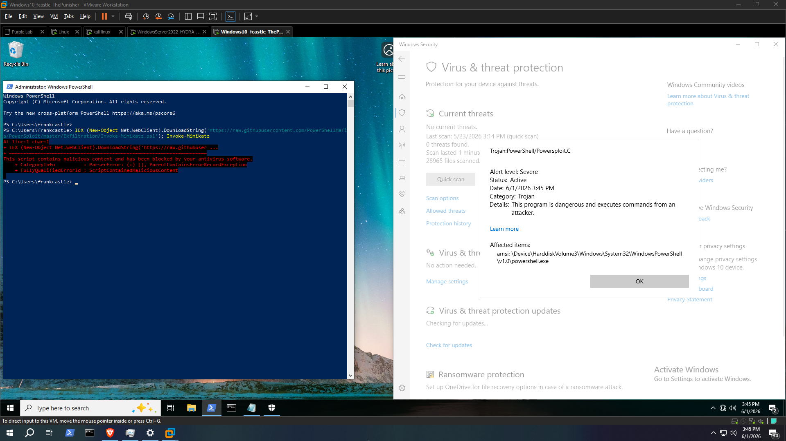
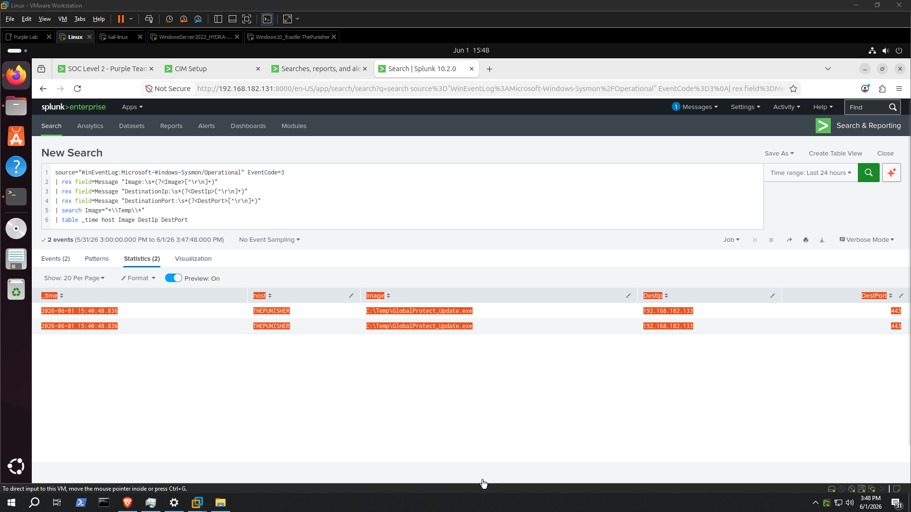

**English** · **[Srpski](README.sr.md)**

# Purple Team Home Lab — Active Directory Detection Engineering

> A self-built Active Directory lab where every attack is run, detected in Splunk, then
> stress-tested for what default tooling **misses** — and the gap is closed and re-proven.
> Built to demonstrate SOC L2 thinking: methodology, not tool execution.

**This README is the 2-minute scan.** The deep-dive videos and full playbooks are
optional evidence linked below.

---

## What this demonstrates

- **Detection engineering** — 9 detections shipped as [Sigma rules](detections/sigma/sigma_rules.yml) (vendor-agnostic) and a deployable [Splunk pack](detections/splunk/purple_lab/), CIM/TA-normalized, version-controlled.
- **Adversary emulation** — 8 MITRE ATT&CK techniques across a full AD kill chain, Defender left **on** throughout.
- **The purple loop** — attack → detect → **find the detection gap** → fix → **re-prove**. The part most labs skip.
- **Hardening ≠ detection** — prevention shrinks the attack surface; it never reaches zero. Detection is the safety net for what slips through.

## Lab

```
                 Kali (attacker) 192.168.182.133
                          │
        ┌─────────────────┼──────────────────┐
        │                 │                  │
  HYDRA-DC .135      THEPUNISHER .137     SPIDERMAN .138
  Win Server 2022    Win 10 endpoint      Win 10 endpoint
  AD DS / MARVEL.LOCAL    │                  │
        └────────── Sysmon + Splunk UF ──────┘
                          │
                  Splunk SIEM 192.168.182.131
```

Five VMs, VMware NAT `192.168.182.0/24`. Sysmon + Splunk Universal Forwarder on every
Windows host; audit policy enforced via GPO.

## MITRE ATT&CK coverage

| Phase | Technique | Tooling | Detection | Prevention |
|---|---|---|---|---|
| Recon | T1046 / T1087.002 | nmap, kerbrute, Certipy | 4768 err 0x6 burst | Segmentation |
| Initial Access | T1110.003 | kerbrute spray | 4771 multi-user/source | FGPP + lockout |
| Execution | T1218.004 | InstallUtil + .NET | LOLBin from user path | AppLocker / WDAC |
| Cred Access | T1558.003 | GetUserSPNs | 4769 RC4 (0x17) | AES + strong pwd + gMSA |
| Lateral / C2 | T1071.001 | Sliver mTLS | **behavioral** beacon | AppLocker + egress filter |
| Cred Access | T1003.002 / .006 | reg save, DCSync | reg-save combo / 4662 | Defender + Credential Guard |
| Persistence | T1053.005 | schtasks | 4698 SYSTEM + user path | Restricted local admin |
| C2 / Exfil | T1071.001 / T1041 | Sliver beacon | Sysmon EID3 + JA3 (NDR) | TLS inspection |

Full coverage matrix and per-technique detection cards: [`03_detection_playbook.md`](03_detection_playbook.md).

## Headline finding — the C2 detection gap (the showcase)

A modern C2 (Sliver, mTLS/443) beaconed from a domain endpoint and **default Sysmon did
not record the network connection** — `NetworkConnect` is not logged for it out of the box.

The naive "fix" is to add the implant's filename to a watchlist. That is an
anti-pattern: rename the binary and the detection dies. The fix shipped here is
**behavioral** — flag *any* process running from a user-writable path (`C:\Temp`,
`AppData`, `ProgramData`) that initiates egress, then confirm with beacon
interval/jitter analysis. A renamed implant still trips it. See
[Sigma rule 7](detections/sigma/sigma_rules.yml) and the CIM `tstats` version in the
Splunk pack.

## Blue-team wins (Defender on, not staged)

- **AMSI blocked Mimikatz** — PowerShell invocation stopped at scan time; the tool never executed.
- **SharpKatz (AMSI-evading) passed Defender** but failed at DRS bind — RPC 1825 (Kerberos auth failure at transport layer). `fcastle` *is* Domain Admin and *does* hold DS-Replication-Get-Changes via `BUILTIN\Administrators` — permissions were never the blocker. Two independent layers stopped DCSync: AMSI on the tool, Kerberos transport on the protocol.

## Dashboard


> Full attack chain visible in one view — 5 counters, MITRE ATT&CK bar chart, and attack timeline spanning the entire lab period. Built in Splunk Simple XML; source in [`detections/splunk/purple_lab/`](detections/splunk/purple_lab/).

## Video walkthrough

Full series (10 segments, ~75 min): [YouTube Playlist](https://www.youtube.com/playlist?list=PLL1zKaMLDyG24fX3g8Ck42y_e6nPrRU4-)

| Segment | Topic |
|---|---|
| Seg 1 | Lab Setup & Recon |
| Seg 2 | Password Spray (T1110.003) |
| Seg 3 | LOLBin Execution (T1218.004) |
| Seg 4 | Kerberoasting (T1558.003) |
| Seg 5 | Lateral Movement / Sliver C2 |
| Seg 6 | Credential Dumping + Defender/AMSI |
| Seg 7 | Persistence (T1053.005) |
| Seg 8 | C2 Evasion + Sysmon Gap Fix |
| Seg 9 | Splunk Dashboard Tour |
| Seg 10 | Production Hardening |

## Screenshots

### 01 — Password Spray detected (T1110.003)

> Splunk 4771 correlation: single source (192.168.182.133 / Kali), 3 unique accounts in a 5-minute window. No lockout triggered — one bad attempt per account is the spray signature.

### 02 — Kerberoasting RC4 ticket (T1558.003)

> 4769 with Ticket_Encryption_Type=**0x17** (RC4-HMAC) for `SQLService`. On a modern AES domain, RC4 service tickets for user-SPNs are anomalous by definition.

### 03 — Lateral Movement via secretsdump (T1003.002)

> 4624 Logon Type 3 (network logon) from Kali (.133) to THEPUNISHER (.137) — credential reuse pivot, SAM hashes extracted via RemoteRegistry.

### 04 — Defender + AMSI blocks Mimikatz (T1003.001)

> `Trojan:PowerShell/Powersploit.C` blocked at AMSI layer before execution. Alert level: Severe. Defender left **on** throughout the lab — this is a genuine blue-team win, not a staged result.

### 05 — C2 Beacon from C:\Temp (T1071.001) — the showcase

> Sysmon EID3: `C:\Temp\GlobalProtect_Update.exe` → 192.168.182.133:443 (Sliver mTLS). Default Sysmon missed this — the SwiftOnSecurity baseline covers `C:\Users` and `C:\ProgramData` but not a bare `C:\Temp`. One line closes the gap. Detection keys on **location**, not filename — a renamed binary still trips it.

## Repo map

```
.
├── README.md / README.sr.md                    <- you are here (the 2-min scan)
├── 01_lab_setup.md / 01_lab_setup.sr.md       <- AD lab build (DC, endpoints, Sysmon, Splunk)
├── 02_attack_playbook.md / 02_attack_playbook.sr.md  <- 8 phases, commands, MITRE mapping
├── 03_detection_playbook.md / 03_detection_playbook.sr.md  <- detection cards, SPL, IR runbook, hardening
├── lab_issues.md / lab_issues.sr.md           <- real build/debug log (GPO/auditpol, ACLs, forwarder)
├── COMMAND_REFERENCE.md                       <- command quick-reference
├── config/sysmonconfig.xml                    <- Sysmon config incl. the C:\Temp NetworkConnect fix
├── screenshots/                               <- 12 detection screenshots (spray, kerb, lateral, amsi, c2, dashboard, persistence, gap demo, hardening)
└── detections/
    ├── sigma/sigma_rules.yml                  <- Detection-as-Code, vendor-agnostic
    └── splunk/purple_lab/                     <- deployable Splunk app (+ cim-acceleration/)
```

## Format note

Primary deliverable is **this repo** — scannable in ~2 minutes. The video series is an
optional deep-dive for reviewers who want to watch the kill chain run end-to-end; a
~1-hour highlight cut (Kerberoasting → Credential Dumping → C2 gap → Dashboard →
Hardening) is the recommended watch. The repo, not the runtime, is the thing a hiring
manager evaluates.

## Scope / honest caveats (lab, not production)

- `C:\Temp` is a Defender exclusion so the payload delivery is reproducible on camera; in
  production it would not be, and the AppLocker fix in Segment 10 addresses exactly that path.
- DC SMB/RPC is firewall-filtered from Kali, so privileged attacks pivot through an
  endpoint — which is the realistic path anyway.
- Single-domain, no NDR/EDR layer yet (Lab v2: pfSense+Suricata/Zeek for JA3, Wazuh, MISP).

---

*Self-taught. Background: TCM Security (SOC 201, Practical Windows Forensics, Detection Engineering for Beginners, Linux 100/101; SOC 101 · PEH · PMAT in progress), TryHackMe (top 1%, 173 rooms).*
